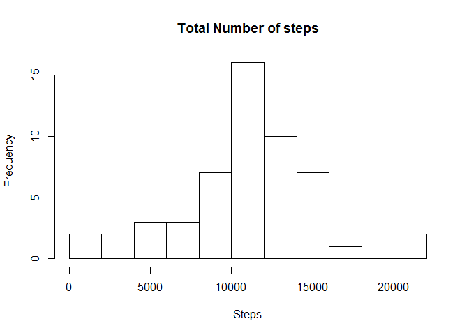
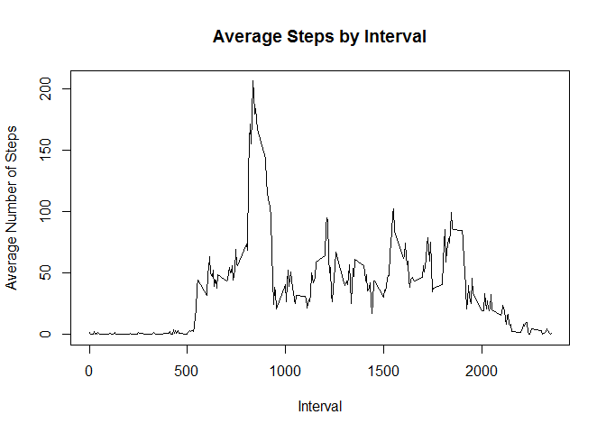
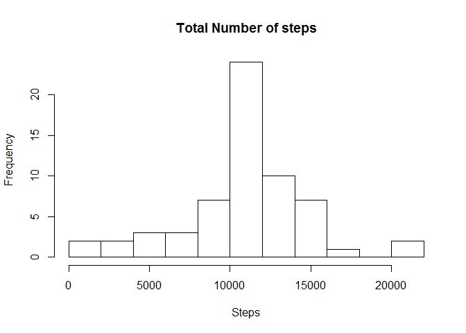
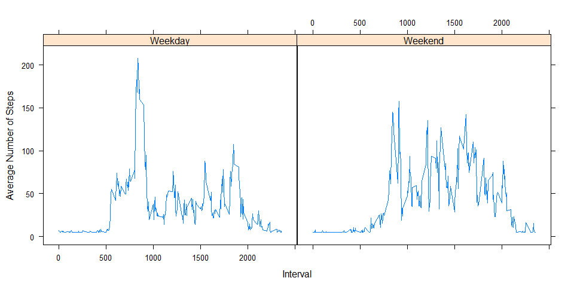

# Reproducible Research: Activity Monitoring
Jose L Rivera  
September 20, 2015  

## Loading and preprocessing the data
1. Load the data

```r
unzip("activity.zip")
data <- read.csv("activity.csv")
summary(data)
```

```
##      steps                date          interval     
##  Min.   :  0.00   2012-10-01:  288   Min.   :   0.0  
##  1st Qu.:  0.00   2012-10-02:  288   1st Qu.: 588.8  
##  Median :  0.00   2012-10-03:  288   Median :1177.5  
##  Mean   : 37.38   2012-10-04:  288   Mean   :1177.5  
##  3rd Qu.: 12.00   2012-10-05:  288   3rd Qu.:1766.2  
##  Max.   :806.00   2012-10-06:  288   Max.   :2355.0  
##  NA's   :2304     (Other)   :15840
```

## What is mean total number of steps taken per day?
1. Calculate the total number of steps taken per day.

```r
totals <- aggregate(steps ~ date, data, sum, na.omit = TRUE)
```
2. Create a Histogram of the total number of steps per day.

```r
hist(totals$steps, main = "Total Number of steps", xlab = "Steps", breaks = 10)
```



3. Calculate and report the mean and median of the total number of steps taken per day.

```r
sMean <- mean(totals$steps)
sMean
```

```
## [1] 10767.19
```

```r
sMedian <- median(totals$steps)
sMedian
```

```
## [1] 10766
```

## What is the average daily activity pattern?
1. Time series plot of the 5-minute interval and the average number of steps taken.

```r
avgsteps <- aggregate(steps ~ interval, data, mean, na.omit = TRUE)

plot(avgsteps$interval,avgsteps$steps, type="l"
     ,xlab="Interval"
     ,ylab="Average Number of Steps"
     ,main="Average Steps by Interval")
```



2. Which 5-minute interval, on average across all the days in the dataset, contains the maximum number of steps?

```r
avgsteps[which.max(avgsteps$steps),]
```

```
##     interval    steps
## 104      835 206.1698
```

## Imputing missing values
1. Calculate and report the total number of missing values in the dataset.

```r
sum(is.na(data$steps))
```

```
## [1] 2304
```
2. Fill all missing values in the dataset with the steps mean (Strategy: We will use the mean of steps to create a new columns called filled that will have the imputed data).

```r
val <- mean(data$steps, na.rm = TRUE)
data$filled <- ifelse(is.na(data$steps),val,data$steps)
```
3. Create a new dataset that is equal to the original dataset but with the missing data filled in.

```r
totals_filled <- aggregate(filled ~ date, data, sum)
```
4. Make a histogram of the total number of steps taken each day and Calculate and report the mean and median total number of steps taken per day.

```r
hist(totals_filled$filled, main = "Total Number of steps", xlab = "Steps", breaks = 10)
```



```r
fMean <- mean(totals_filled$filled)
fMean
```

```
## [1] 10766.19
```

```r
fMedian <-median(totals_filled$filled)
fMedian
```

```
## [1] 10766.19
```

```r
# Calculate Diffs
mean_diff <- sMean-fMean
median_diff <- sMedian-fMedian
```
Filling the missing values with the mean created a small deviance from the previous result. In actual numbers, the mean and median variation are **1** and **-0.1886792** respectively.

## Are there differences in activity patterns between weekdays and weekends?
1. Create a new factor variable in the dataset with two levels (weekday and weekend).

```r
data$WkDay <- as.factor(ifelse(weekdays(as.Date(data$date)) %in% c("Saturday", "Sunday"), "Weekend", "Weekday"))
WkDaySteps <- aggregate(filled ~ interval + WkDay, data, mean)
```
2. Create a new factor variable in the dataset with two levels (weekday and weekend).

```r
library(lattice)
xyplot(filled ~ interval | WkDay, WkDaySteps
        ,type = "l"
        ,layout = c(2,1)
        ,xlab = "Interval"
        ,ylab = "Average Number of Steps"
)
```


